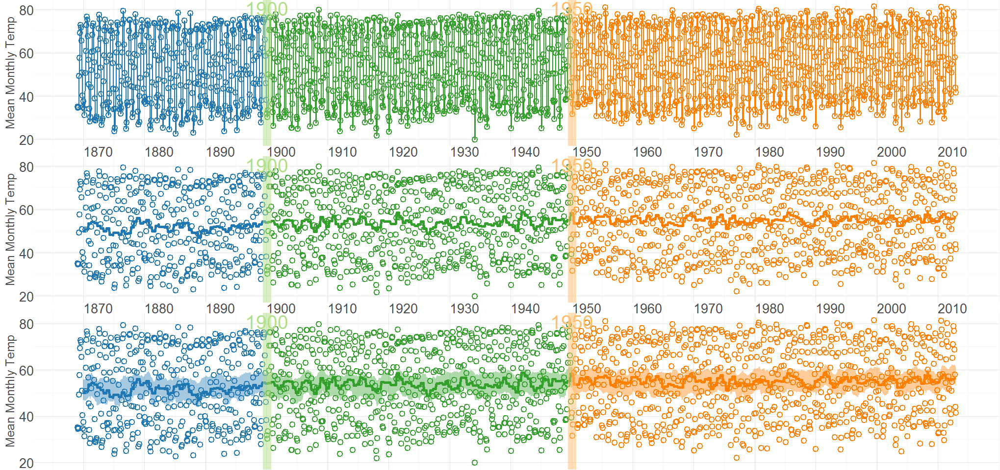
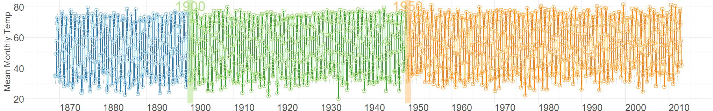

<!--
%\VignetteEngine{knitr::knitr}
%\VignetteIndexEntry{Central Park Temperatures}
-->

# Monthly Temperatures in Central Park
http://www.erh.noaa.gov/okx/climate/records/monthannualtemp.html


```r
inputPath <- "./CentralPark/Data/Derived/CentralParkTemp.csv"
# changeMonths <- c(as.Date("1900-01-15"), as.Date("1950-01-15"), as.Date("2000-01-15"))
# changeLabels <- c("1900", "1950", "2000")
changeMonths <- c(as.Date("1900-01-15"), as.Date("1950-01-15"))
changeLabels <- c("1900", "1950")

vpLayout <- function(x, y) { grid::viewport(layout.pos.row=x, layout.pos.col=y) }

fullSpread <- function( scores ) { 
  return( base::range(scores) ) #A new function isn't necessary.  It's defined in order to be consistent.
}
hSpread <- function( scores ) { 
  return( stats::quantile(x=scores, probs=c(.25, .75)) ) 
}
seSpread <- function( scores ) { 
  return( base::mean(scores) + base::c(-1, 1) * stats::sd(scores) / base::sqrt(base::length(scores)) ) 
}
bootSpread <- function( scores, conf=.66 ) {
  plugin <- function( d, i ) { base::mean(d[i]) }

  dist <- boot::boot(data=scores, plugin, R=99) #999 for the publication
  ci <- boot::boot.ci(dist, type = c("bca"), conf=conf)
  return( ci$bca[4:5] ) #The fourth & fifth elements correspond to the lower & upper bound.
}

darkTheme <- ggplot2::theme(
  axis.title          = ggplot2::element_text(color="gray30", size=9),
  axis.text.x         = ggplot2::element_text(color="gray30", hjust=0),
  axis.text.y         = ggplot2::element_text(color="gray30"),
  axis.ticks.length   = grid::unit(0, "cm"),
  axis.ticks.margin   = grid::unit(.00001, "cm"),
#   panel.grid.minor.y  = element_line(color="gray95", size=.1),
#   panel.grid.major    = element_line(color="gray90", size=.1),
  panel.margin        = grid::unit(c(0, 0, 0, 0), "cm"),
  plot.margin         = grid::unit(c(0, 0, 0, 0), "cm")
)
lightTheme <- darkTheme + ggplot2::theme(
  axis.title          = ggplot2::element_text(color="gray80", size=9),
  axis.text.x         = ggplot2::element_text(color="gray80", hjust=0),
  axis.text.y         = ggplot2::element_text(color="gray80"),
  panel.grid.minor.y  = ggplot2::element_line(color="gray99", size=.1),
  panel.grid.major    = ggplot2::element_line(color="gray95", size=.1)
)
dateSequence <- base::as.Date(c("1870-01-01","1880-01-01","1890-01-01",
                              "1900-01-01","1910-01-01","1920-01-01","1930-01-01","1940-01-01",
                              "1950-01-01","1960-01-01","1970-01-01","1980-01-01","1990-01-01",
                              "2000-01-01","2010-01-01"))
xScale       <- ggplot2::scale_x_date(breaks=dateSequence, labels=scales::date_format("%Y"))
xScaleBlank  <- ggplot2::scale_x_date(breaks=dateSequence, labels=NULL) #This keeps things proportional down the three frames.

# paletteDark <- RColorBrewer::brewer.pal(n=10L, name="Paired")[c(2L,4L,6L,8L)][c(1, 2, 4, 3)]
# paletteLight <- RColorBrewer::brewer.pal(n=10L, name="Paired")[c(1L,3L,5L,7L)][c(1, 2, 4, 3)]
paletteDark <- RColorBrewer::brewer.pal(n=10L, name="Paired")[c(2L,4L,6L,8L)][c(1, 2, 4)]
paletteLight <- RColorBrewer::brewer.pal(n=10L, name="Paired")[c(1L,3L,5L,7L)][c(1, 2, 4)]
    
```


```r
dsLinear <- utils::read.csv(inputPath, stringsAsFactors=FALSE)
dsLinear <- dsLinear[dsLinear$Year <= 2012L, ] #The 2013 year is missing
dsLinear$StageID <- dsLinear$CenturyHalfID
dsLinear$StageID <- ifelse(dsLinear$StageID==4L, 3L, dsLinear$StageID)
dsLinear$Date <- base::as.Date(dsLinear$Date)
# sapply(dsLinear, class)
```

## Section 1: Cartesian Rolling Plot
This section corresponds to the MBR manuscript, but with the modified dataset.

Smoothed monthly  birth rates (General Fertility Rates;  GFR's) for Oklahoma County, 1990-1999, plotted in a linear plot.  The top plot shows the connected raw data with a February smoother; the middle plot shows smoothing with a 12-month moving average, blue/green line, superimposed on a February smoother, red tan line); the bottom plot shows the smoothers and confidence bands, which are H-spreads (ie, the distance between the .25 and .75 quantiles) defined using the distribution of GFR's for the given month and 11 previous months.


```r

dsLinear <- Wats::AugmentYearDataWithMonthResolution(dsLinear=dsLinear, dateName="Date")

portfolioCartesian <- Wats::AnnotateData(
  dsLinear = dsLinear, 
  dvName = "Temp", 
  centerFunction = stats::median, 
  spreadFunction = seSpread)
#   spreadFunction = hSpread)


topPanel <- Wats::CartesianRolling(
  dsLinear = portfolioCartesian$dsLinear, 
  xName = "Date",
  yName = "Temp",
  stageIDName = "StageID",
  changePoints = changeMonths,
  changePointLabels = changeLabels,
  yTitle = "Mean Monthly Temp",
  drawRollingBand = FALSE,
  drawRollingLine = FALSE,
  drawSparseLineAndPoints = FALSE,
  paletteDark = paletteDark,
  paletteLight = paletteLight
)

middlePanel <- CartesianRolling(
  dsLinear = portfolioCartesian$dsLinear, 
  xName = "Date", 
  yName = "Temp", 
  stageIDName = "StageID",
  changePoints = changeMonths, 
  changePointLabels = changeLabels,
  yTitle = "Mean Monthly Temp",
  drawRollingBand = FALSE, 
  drawJaggedLine = FALSE,
  drawSparseLineAndPoints = FALSE,
  paletteDark = paletteDark,
  paletteLight = paletteLight
)

bottomPanel <- Wats::CartesianRolling(
  dsLinear = portfolioCartesian$dsLinear, 
  xName = "Date", 
  yName = "Temp", 
  stageIDName = "StageID", 
  changePoints = changeMonths, 
  yTitle = "Mean Monthly Temp", 
  changePointLabels = changeLabels, 
  drawJaggedLine = FALSE,
  drawSparseLineAndPoints = FALSE,
  paletteDark = paletteDark,
  paletteLight = paletteLight
)

topPanel <- topPanel + xScale + darkTheme
middlePanel <- middlePanel + xScale + darkTheme
bottomPanel <- bottomPanel + xScaleBlank + darkTheme

grid::grid.newpage()
grid::pushViewport(grid::viewport(layout=grid::grid.layout(3,1)))
print(topPanel, vp=vpLayout(1, 1))
print(middlePanel, vp=vpLayout(2, 1))
```

```
Warning: Removed 11 rows containing missing values (geom_path).
```

```r
print(bottomPanel, vp=vpLayout(3, 1))
```

```
Warning: Removed 11 rows containing missing values (geom_path).
```

```r
grid::popViewport()
```




## Section 2: Carteisan Periodic 
This section corresponds to the MBR manuscript, but with the modified dataset.

Carteisan plot of the GFR time series data in Oklahoma County, with H-spread Bands superimposed.


```r
cartesianPeriodic <- Wats::CartesianPeriodic(
  portfolioCartesian$dsLinear, 
  portfolioCartesian$dsPeriodic, 
  xName = "Date", 
  yName = "Temp",
  stageIDName = "StageID", 
  changePoints = changeMonths, 
  changePointLabels = changeLabels,
  yTitle = "Mean Monthly Temp",
  paletteDark = paletteDark,
  paletteLight = paletteLight,
  drawPeriodicBand = TRUE #The only difference from the simple linear graph above
)
cartesianPeriodic <- cartesianPeriodic + xScale + darkTheme 
print(cartesianPeriodic)
```




## Section 3: Polar Periodic
This section corresponds to the MBR manuscript, but with the modified dataset.

Wrap Around Time Series (WATS Plot) of the Oklahoma City GFR data, 1990-1999


```r
portfolioPolar <- Wats::PolarizeCartesian(
  dsLinear = portfolioCartesian$dsLinear, 
  dsStageCycle = portfolioCartesian$dsStageCycle, 
  yName = "Temp", 
  stageIDName = "StageID", 
  plottedPointCountPerCycle = 7200,
  graphFloor = 20
)

dsO <- portfolioPolar$dsObservedPolar
dsS <- portfolioPolar$dsStageCyclePolar
# 
min(dsO$Radius)
```

```
[1] 20.53
```

```r
# dsS[which.min(dsO$Radius), ]


grid::grid.newpage()
grid::pushViewport(grid::viewport(
  layout=grid::grid.layout(
    nrow = 2, ncol = 2, respect = TRUE, 
    widths = grid::unit(c(1,1), c("null", "null")), 
    heights = grid::unit(c(1,.5), c("null", "null"))
  ), 
  gp = grid::gpar(cex=1, fill=NA)
))

graphFloor <- 20
graphCeiling <- 80
tickLocations <- seq(from=graphFloor, to=graphCeiling, by=20)
  
## Create top left panel
grid::pushViewport(grid::viewport(layout.pos.col=1, layout.pos.row=1))
topLeftPanel <- Wats::PolarPeriodic(
  dsLinear = portfolioPolar$dsObservedPolar, 
  dsStageCyclePolar = portfolioPolar$dsStageCyclePolar, 
  yName = "Radius", 
  stageIDName = "StageID",
  drawPeriodicBand = FALSE,
  drawRadiusLabels = TRUE,
  tickLocations = tickLocations,
  cardinalLabels = c("Jan1", "Apr1", "July1", "Oct1"),
  paletteDark = grDevices::adjustcolor(paletteDark, alpha.f=.2),
  paletteLight = grDevices::adjustcolor(paletteLight, alpha.f=.2)
)
grid::upViewport()

## Create top right panel
grid::pushViewport(grid::viewport(layout.pos.col=2, layout.pos.row=1))
topRighttPanel <- Wats::PolarPeriodic(
  dsLinear = portfolioPolar$dsObservedPolar, 
  dsStageCyclePolar = portfolioPolar$dsStageCyclePolar, 
  yName = "Radius", 
  stageIDName = "StageID",
  drawObservedLine = FALSE,
  tickLocations = tickLocations,
  cardinalLabels = c("Jan1", "Apr1", "July1", "Oct1"),
  paletteDark = paletteDark,
  paletteLight = paletteLight, 
  originLabel = NULL
)
grid::upViewport()

## Create bottom panel
grid::pushViewport(grid::viewport(layout.pos.col=1:2, layout.pos.row=2, gp=grid::gpar(cex=1)))
print(cartesianPeriodic, vp=vpLayout(x=1:2, y=2)) #Print across both columns of the bottom row.
upViewport()
```


## Section 4: Confirmatory Analysis of Interrupted Time Series
The remaining two sections depart from the MBR manuscript analyses.  Its goal is to determine if the significant findings of Rodgers, St. John, & Coleman still appear with the modified Census estimates.  As shown below, the the post-bombing fertility is still significantly higher than the pre-bombing fertility.

This section uses an approach advocated by McLeod, Yu, & Mahdi (2011), which is consistent other articles, including Rodgers et al. (2005).  There are two trends that are de-seasonalized.  The first is the 'classic' approach which uses the observed trend line (see [`decompose()` on CRAN](http://stat.ethz.ch/R-manual/R-devel/library/stats/html/decompose.html)).  The second is a smoothed version, where a loess is passed through the observed data; this smoothed line is then de-seasonalized (see [`stl()` on CRAN](stat.ethz.ch/R-manual/R-devel/library/stats/html/stl.html)).  Both approaches lead to comparable conclusions.  The post-bombing fertility is significantly higher  than the pre-bombing fertility (ie, the `step` coefficient is significantly more positive).


```r
dsLinear <- Wats::AugmentYearDataWithMonthResolution(dsLinear=dsLinear, dateName="Date")

tsData <- stats::ts(
  data = dsLinear$Temp, 
  start = as.integer(dsLinear[1, c("Year", "Month")]), 
  end = as.integer(dsLinear[nrow(dsLinear), c("Year", "Month")]),
  frequency = 12L
)

#Create unsmoothed and smoothed version
seasonalClassic <- stats::decompose(tsData)
plot(seasonalClassic)
```


```r

#Watch out, the 2nd & 3rd columns have swapped positions, compared to `decompose()`
seasonalLoess <- stats::stl(x = tsData, s.window = "periodic") 
plot(seasonalLoess)
```


```r

# Seasonality is accounted for without a smoother
lag1 <- 1L #Significant for many different values of lag, including 1
y <- seasonalClassic$trend[(lag1+1):length(seasonalClassic$trend)]
y1 <- seasonalClassic$trend[1:(length(seasonalClassic$trend)-lag1)]
# step <- c(rep(0L, times=sum(dsLinear$StageID==1L)-lag1), rep(1L, times=sum(dsLinear$StageID==2L)))
step <- dsLinear$StageID[(lag1+1):length(seasonalClassic$trend)] - 1L
dsClassic <- data.frame(y=y, y1=y1, step=step)
rm(lag1, y, y1, step)
fitClassic <-  glm(y ~ 1 + step + y1, data=dsClassic)
summary(fitClassic)
```

```

Call:
glm(formula = y ~ 1 + step + y1, data = dsClassic)

Deviance Residuals: 
    Min       1Q   Median       3Q      Max  
-1.0393  -0.1725   0.0043   0.1756   1.1528  

Coefficients:
            Estimate Std. Error t value Pr(>|t|)    
(Intercept)  1.23187    0.28123    4.38  1.3e-05 ***
step         0.03360    0.01167    2.88    0.004 ** 
y1           0.97643    0.00539  181.02  < 2e-16 ***
---
Signif. codes:  0 '***' 0.001 '**' 0.01 '*' 0.05 '.' 0.1 ' ' 1

(Dispersion parameter for gaussian family taken to be 0.07719)

    Null deviance: 4824.91  on 1714  degrees of freedom
Residual deviance:  132.15  on 1712  degrees of freedom
  (12 observations deleted due to missingness)
AIC: 479.1

Number of Fisher Scoring iterations: 2
```

```r

#Seasonality is accounted for after a loess is fit through it.
lag1 <- 1L #Significant for many different values of lag, including 1
trendLineLoess <- as.numeric(seasonalLoess$time.series[, 2])
y <- trendLineLoess[(lag1+1):length(trendLineLoess)]
y1 <- trendLineLoess[1:(length(trendLineLoess) - lag1)]
# step <- c(rep(0L, times=sum(dsLinear$StageID==1L)-lag1), rep(1L, times=sum(dsLinear$StageID==2L)))
step <- dsLinear$StageID[(lag1+1):length(trendLineLoess)] - 1L
dsLoess <- data.frame(y=y, y1=y1, step=step)
rm(lag1, y, y1, step)
fitLoess <-  glm(y ~ 1 + step + y1, data=dsLoess)
summary(fitLoess)
```

```

Call:
glm(formula = y ~ 1 + step + y1, data = dsLoess)

Deviance Residuals: 
    Min       1Q   Median       3Q      Max  
-0.7468  -0.1384   0.0026   0.1423   0.6866  

Coefficients:
            Estimate Std. Error t value Pr(>|t|)    
(Intercept)  0.74382    0.21564    3.45  0.00058 ***
step         0.01956    0.00891    2.19  0.02833 *  
y1           0.98576    0.00414  238.34  < 2e-16 ***
---
Signif. codes:  0 '***' 0.001 '**' 0.01 '*' 0.05 '.' 0.1 ' ' 1

(Dispersion parameter for gaussian family taken to be 0.0451)

    Null deviance: 4834.202  on 1726  degrees of freedom
Residual deviance:   77.758  on 1724  degrees of freedom
AIC: -445.6

Number of Fisher Scoring iterations: 2
```


## Session Info
The current vignette was build on a system using the following software.


```
Report created by Will at 12/31/2013 2:28:39 PM, CST
```

```
R Under development (unstable) (2013-12-28 r64574)
Platform: x86_64-w64-mingw32/x64 (64-bit)

locale:
[1] LC_COLLATE=English_United States.1252  LC_CTYPE=English_United States.1252    LC_MONETARY=English_United States.1252
[4] LC_NUMERIC=C                           LC_TIME=English_United States.1252    

attached base packages:
[1] grid      stats     graphics  grDevices utils     datasets  methods   base     

other attached packages:
[1] Wats_0.2-11     boot_1.3-9      ggplot2_0.9.3.1 scales_0.2.3    plyr_1.8        knitr_1.5      

loaded via a namespace (and not attached):
 [1] colorspace_1.2-4   dichromat_2.0-0    digest_0.6.4       evaluate_0.5.1     formatR_0.10       gtable_0.1.2      
 [7] labeling_0.2       lattice_0.20-24    lubridate_1.3.2    MASS_7.3-29        memoise_0.1        munsell_0.4.2     
[13] proto_0.3-10       RColorBrewer_1.0-5 reshape2_1.2.2     stringr_0.6.2      testit_0.3         tools_3.1.0       
[19] zoo_1.7-10        
```


## References
* McLeod, A.I., Yu, H., & Mahdi, E. (2011). [Time series analysis with R](http://www.stats.uwo.ca/faculty/aim/tsar/tsar.pdf). *Handbook of Statistics*, Volume 30, Elsevier. 
* Rodgers, J. L., St. John, C. A. & Coleman R.  (2005).  [Did Fertility Go Up after the Oklahoma City Bombing?  An Analysis of Births in Metropolitan Counties in Oklahoma, 1990-1999](http://www.ncbi.nlm.nih.gov/pubmed/16463916).  *Demography, 42*, 675-692.
* [Average Monthly and Annual Temperatures at Central Park](http://www.erh.noaa.gov/okx/climate/records/monthannualtemp.html) from Jan 1869 to Sep 2013, which was found from page 506, footnote 56 from *The Signal and the Noise*, Nate Silver (2012).
